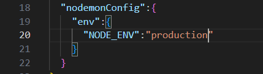

# GraphQL

## Production environment

1. To disable
   1. Introspection
   2. Playground

Add the following code in the `package.json` file

```
  "nodemonConfig":{
    "env":{
      "NODE_ENV":"production"
    }
  }
```



or

you can add the settings in

```Javascript
const server = new ApolloServer({
    ...,
    introspection:false,
    playground:false
});

```
